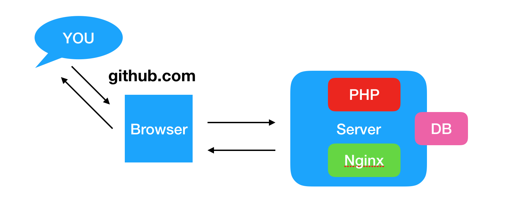

# Chapter 1, Video 3: A web page behind the scenes

### Description
Simplified Overview of how it works when you go to a website.
If you feel you need an overview again, have a look at this video again.

Goal: Have a simple overview and understanding of how web servers work. 

---- 

When you enter a link in a browser, the browser needs to know where to go to get the content for you. The browser talks to another machine over the Internet, which similarly to a post address, has the address of the link you requested. That machine is called a "server". The server is in charge of reading the request that the browser made. 

The request has a lot of information. Some of the information is about which type of content you want. The request also contains details about your browser and your location. 

On the server you have software that handles the request you made. This software is called a "web server". Two of the most popular web server software used today are called "nginx" and "apache". We will go into this in more detail later. They both work well with PHP.

The web server will handle the request, and if the requested page has PHP code in it, it will run that code. 
When PHP runs the code it can return data to the web server.

It can also communicate with other systems. If you want to read or store information you could use a storage solution such as a database. We will explain more about databases in a later video.

The web server takes the data that we defined in the PHP code and returns it to the browser in a response.

Now the browser takes that response and displays that to you. The most common way of displaying the data is HTML, which is a semantic way of formatting web pages that all browsers understand. It can contain information about which content is a paragraph, what is an image and other things. It describes your content so that the web browser knows how to display it. It can include links to other pages or even video's. 

